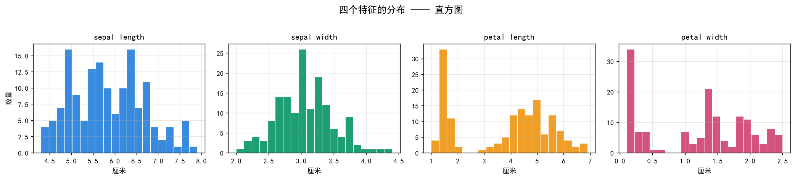
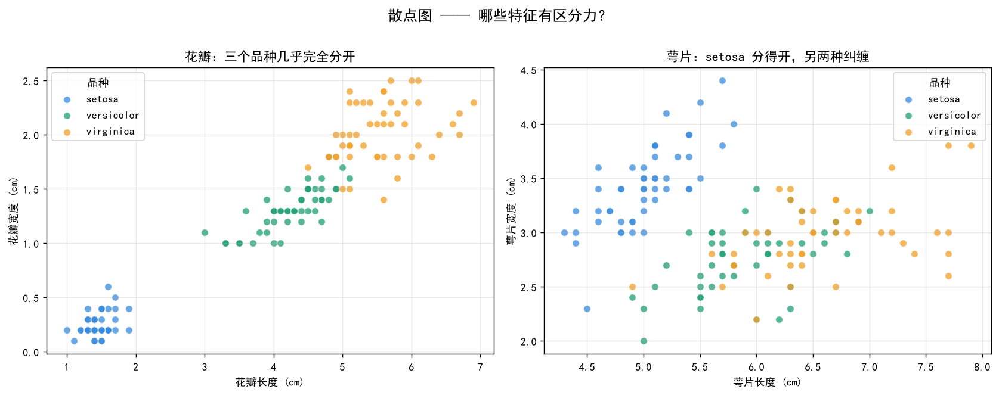
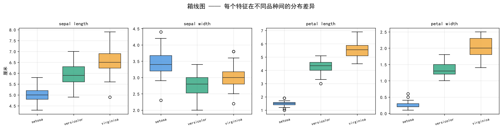
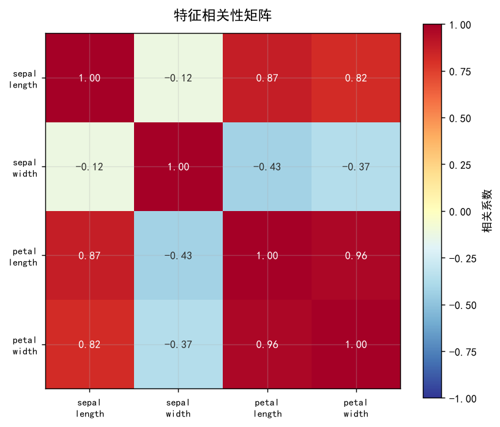
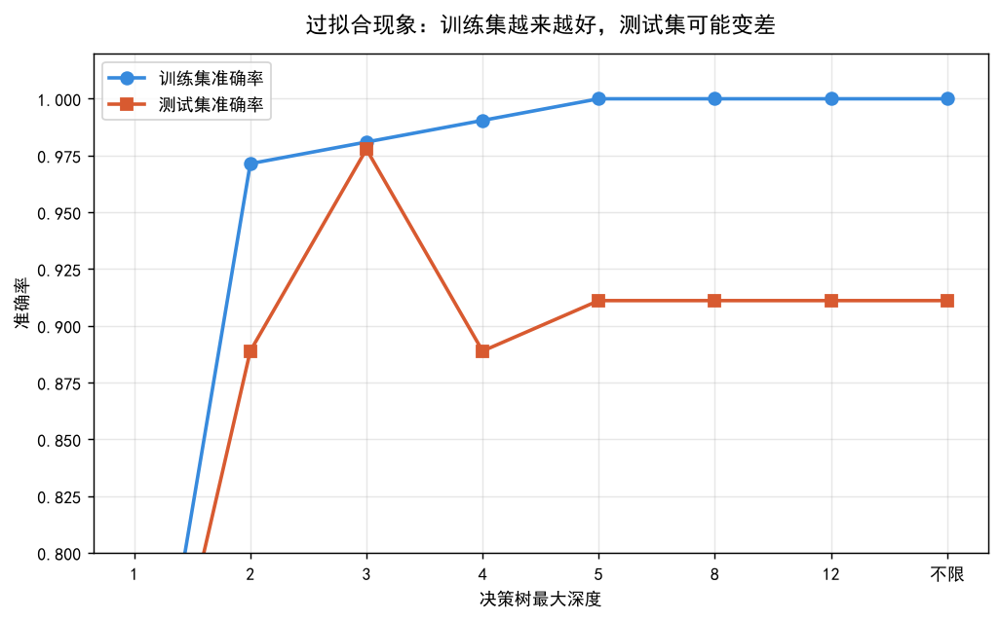
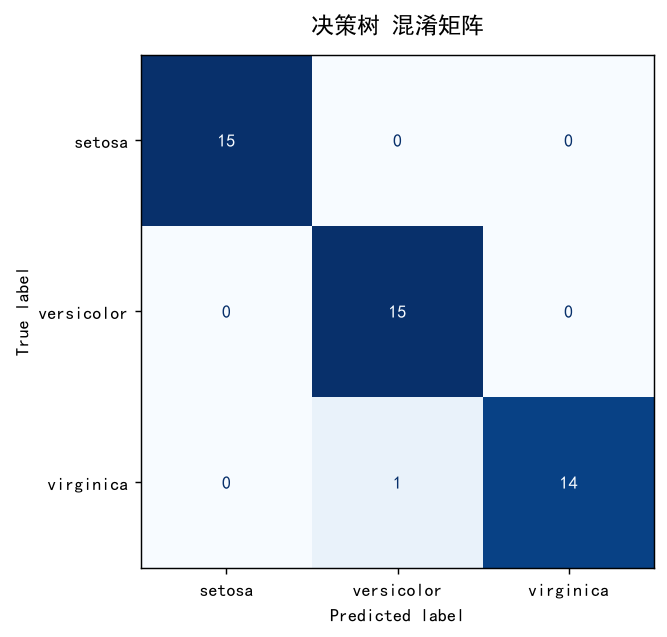

# ML Journey


从零开始的机器学习实践记录。每一课的代码都实际跑通过，图表都是真实输出。

目标：把基础打扎实，做出可以拿得出手的开源项目，并进入实验室做真正的研究。

---

## 学习进度

| 阶段 | 内容 | 状态 |
|---|---|---|
| 第 1 课 | numpy 基础：数组、形状、索引、广播 | ✅ 完成 |
| 第 2 课 | pandas + matplotlib：数据探索与可视化 | ✅ 完成 |
| 第 3 课 | 完整 ML 流程：划分、标准化、训练、评估 | ✅ 完成 |
| 第 4 课 | 特征工程与模型调参（GridSearchCV） | ⬜ 待做 |
| 第 5 课 | PyTorch 与神经网络 | ⬜ 待做 |
| 第 6 课 | 卷积神经网络 CNN | ⬜ 待做 |

详细规划见 [`docs/ROADMAP.md`](docs/ROADMAP.md)。

---

## 目录结构

```
ml-journey/
├── 01-basics/                      # 基础课代码
│   ├── 01_hello_numpy.py           # numpy 入门
│   ├── 02_pandas_matplotlib.py     # 数据探索 + 4 类图
│   └── 03_first_model.py           # 完整 ML 流程
├── docs/
│   └── ROADMAP.md                  # 学习路线规划
├── notebooks/                      # Jupyter 笔记（预留）
├── data/                           # 数据集（不入库）
├── outputs/                        # 运行产出的图表
├── requirements.txt                # 依赖（版本已锁定）
├── .gitignore
└── LICENSE
```

---

## 快速开始

```bash
# 1. 克隆
git clone https://github.com/ShiyiH11/ml-journey.git
cd ml-journey

# 2. 创建虚拟环境
python -m venv .venv

# 3. 激活
# Windows PowerShell:
.\.venv\Scripts\Activate.ps1
# macOS / Linux:
# source .venv/bin/activate

# 4. 安装依赖（国内用清华镜像）
pip install -r requirements.txt -i https://pypi.tuna.tsinghua.edu.cn/simple

# 5. 运行
python 01-basics/01_hello_numpy.py
python 01-basics/02_pandas_matplotlib.py
python 01-basics/03_first_model.py
```

---

## 第 1 课 · numpy 基础

核心是**向量化**：不用写循环，直接对整个数组做运算。

```python
np_arr = np.array([1, 2, 3, 4, 5])
np_arr * 2          # array([ 2,  4,  6,  8, 10])  —— 一行搞定
```

最有用的部分是**广播**。数据标准化这件事，在 numpy 里就一行：

```python
normalized = (data - data.mean(axis=0)) / data.std(axis=0)
```

`(150, 4)` 的数据减掉 `(4,)` 的均值向量，numpy 自动对齐，不需要任何循环。

**易错点**：深度学习中 90% 的 bug 都源于张量维度搞错。任何报错先看 `shape`。

---

## 第 2 课 · 数据探索与可视化

用鸢尾花数据集走完「看数据 → 出图 → 读图」的流程。

**直方图**——看单个特征的分布：



**散点图**——判断哪些特征有区分力。这张图直接告诉我们答案：



左图（花瓣）三个品种几乎完全分开，右图（萼片）里绿色和橙色纠缠在一起。
**结论：花瓣的特征比萼片有用得多。** 这就是特征工程的起点——先用眼睛看，再动手算。

**箱线图**——比较不同类别间的分布差异：



**相关性矩阵**——发现特征冗余：



花瓣长度和花瓣宽度的相关系数是 **0.96**，说明这两个特征携带的信息几乎重复。
保留一个就够了——特征冗余会拖慢训练，还可能让模型学到虚假规律。

---

## 第 3 课 · 完整的机器学习流程

这是第一个真正意义上的完整流程。

### 流程

```
准备数据 → 划分训练/测试 → 特征标准化 → 训练模型 → 评估 → 查过拟合 → 交叉验证
```

### 三个必须记住的结论

**① 训练集和测试集绝对不能混用**

如果拿全部数据训练、再用同一批数据测试，模型只要「背下来」就能拿满分。
这就像考前把答案给学生背，然后夸他考得好。

### ② 过拟合长什么样



决策树越深，训练集准确率一路涨到 **100%**，但测试集准确率在树深 3 达到峰值后**掉头向下**。

两条线之间的裂口，就是过拟合。模型把训练数据的噪声也背下来了，面对新数据反而变差。

> 训练集 100% + 测试集 90% ≠ 好模型
> 训练集 96% + 测试集 95% = 真的好模型

**做研究必须同时报告两个数字。** 只报一个，会被审稿人直接指出。

### ③ 单次划分是会骗人的

混淆矩阵：



单次划分下，决策树看着最好（97.8%）。但做 5 折交叉验证后：

| 模型 | 交叉验证均值 | 标准差 |
|---|---|---|
| KNN | 0.9524 | 0.0426 |
| 逻辑回归 | **0.9810** | 0.0233 |
| 决策树 | 0.9524 | 0.0301 |

**决策树其实和 KNN 一个水平**，之前的「最好」只是那次划分的运气。

论文里的标准写法是 `准确率 95.3% ± 1.2%`——**标准差不能省**，它反映结果的稳定性。

### 一个新手常犯的致命错误

特征标准化时，`scaler` 只能在训练集上 `fit`，测试集只能 `transform`：

```python
X_train_scaled = scaler.fit_transform(X_train)   # ✅ 在训练集上学习均值方差
X_test_scaled  = scaler.transform(X_test)        # ✅ 用同一套参数处理测试集
```

如果测试集也参与计算均值，就等于提前偷看了测试数据。这个错误叫**数据泄露 (data leakage)**，是论文里最常见的致命伤之一。

---

## 环境说明

| 项目 | 版本 |
|---|---|
| Python | 3.13 |
| numpy | 2.5.3 |
| pandas | 3.0.5 |
| matplotlib | 3.11.2 |
| scikit-learn | 1.9.1 |

**踩过的坑**：matplotlib 3.9 起，`Axes.boxplot()` 的 `labels=` 参数已改名为 `tick_labels=`。
用旧写法会直接报 `TypeError: unexpected keyword argument 'labels'`。

**中文字体**：绘图脚本必须设置，否则中文显示为方块。

```python
plt.rcParams['font.sans-serif'] = ['SimHei', 'Microsoft YaHei']
plt.rcParams['axes.unicode_minus'] = False
```

---

## 关于

本科阶段的机器学习学习记录。每份代码都实际运行验证过，不留未跑通的示例。

欢迎交流与指正 —— [@ShiyiH11](https://github.com/ShiyiH11)

---

## 许可

[MIT](LICENSE)
